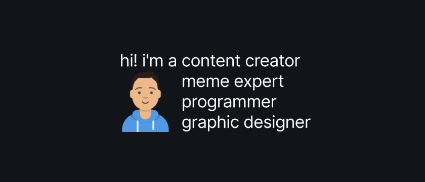

## Programming languages
I mostly develop in these programming languages
- Zig
- Rust
- C/C++
- Python
- JavaScript

## Projects I'm working on
- [Kora](https://github.com/kora-org/kora) - A modern operating system built for the modern era.
  - [Headstart](https://github.com/leap0x7b/xeptoboot) - A UEFI bootloader for Kora.
- [triaOS](https://github.com/leap0x7b/triaos) - A classic operating system inspired by old Mac OS and Windows 9x.

